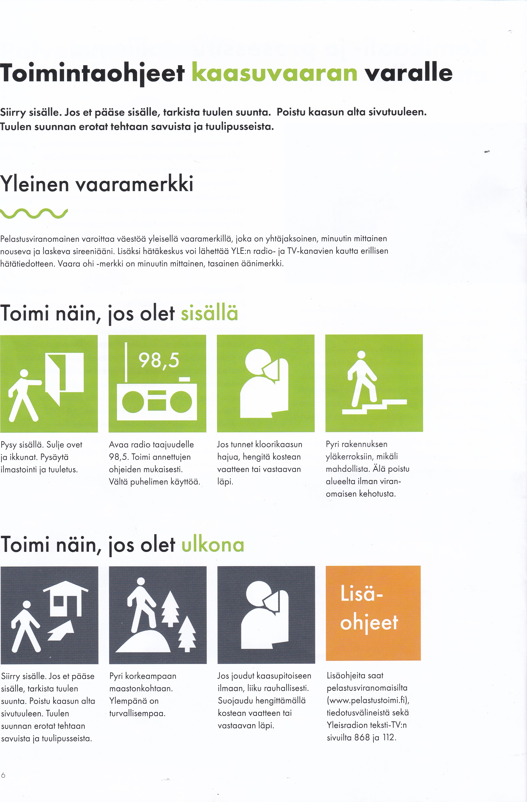

As. Oy Piiluvaranta toimintaohjeet

Laadittu 21.5.2013

Laatija Jukka Aaltonen

Viimeksi päivitetty 6.6.2024

Päivittäjä Matias Aaltonen

Näissä toimintaohjeissa on 12 sivua.

# Sisällys

[Toimintaohjeita](#toimintaohjeita)

[1 Avun hälyttäminen](#1-avun-hälyttäminen)

[2 Sairauskohtaus tai tapaturma](#2-sairauskohtaus-tai-tapaturma)

[3 Tulipalo](#3-tulipalo)

[4 Toiminta kokoontumispaikalla](#4-toiminta-kokoontumispaikalla)

[5 Liikuntarajoitteisen avustaminen hätätilanteessa](#5-liikuntarajoitteisen-avustaminen-hätätilanteessa)

[6 Vesivahinko](#6-vesivahinko)

[7 Väkivallan uhatessa](#7-väkivallan-uhatessa)

[8 Yleinen vaaramerkki](#8-yleinen-vaaramerkki)

[9 Kaasuvaara](#9-kaasuvaara)

[10 Säteilyvaara](#10-säteilyvaara)

[11 Sähkökatkot](#11-sähkökatkot)
 

[Etelä-Karjalan pelastuslaitos Rivitalon paloturvallisuusopas 2019](_assets/Etela-Karjalan%20pelastuslaitos%20Rivitalon%20paloturvallisuusopas%202019_web.pdf)

---
# Toimintaohjeita

Seuraavilla sivuilla on selostus ohjeista onnettomuuksien ehkäisemiseksi sekä onnettomuus- ja vaaratilanteissa toimimiseksi. **Lue toimenpideohjeet tarkasti!**

Oikeat toimenpiteet, ratkaisut ja valinnat ehkäisevät ja rajoittavat onnettomuuksia. Vahinkoja voidaan näin minimoida tai ne voidaan poistaa kokonaan.

**Turvallisuus on kaikkien yhteinen asia!**

## 1 Avun hälyttäminen

Kaikissa kiireellisissä hätätilanteissa, olipa kyse sitten poliisin, pelastustoimen, sairaankuljetuksen tai sosiaalitoimen kiireellisestä avuntarpeesta **SOITA NUMEROON: 112**

#### Soita hätäpuhelu itse, jos voit

Tärkeää on, että hätäpuhelun soittaa se, jota asia koskee. Hänellä on tietoja, joita päivystäjä tarvitsee määritellessään millaista apua paikalle lähetetään. Välikäsien kautta tuleva puhelu voi viivästyttää avun paikalle tuloa.

#### Kerro, mitä on tapahtunut

Hätäkeskuspäivystäjä kysyy soittajalta tietoja tapahtuneesta, jotta hän osaa tarvittaessa lähettää tilanteeseen oikean avun.

#### Kerro tarkka osoite ja kunta

Hätäkeskuksen alueella saattaa olla useita samoja osoitteita eri kunnissa. Siksi on tärkeää kertoa osoitteen lisäksi tapahtumapaikkakunta.

#### Vastaa sinulle esitettyihin kysymyksiin

Päivystäjän esittämillä kysymyksillä on tarkoituksensa. Kysymykset eivät viivästytä avun hälyttämistä. Kiireellisessä tapauksessa päivystäjä hälyttää jo puhelun aikana auttamaan tulevat viranomaiset ja yhteistyökumppanit, sekä antaa näille lisätietoja tapahtuneesta.

#### Toimi annettujen ohjeiden mukaan

Päivystäjä on koulutettu antamaan ohjeita eri tilanteisiin. On tärkeää noudattaa annettuja ohjeita. Oikein suoritetuilla ensitoimenpiteillä on usein merkitystä tilanteen lopputuloksen kannalta.

#### Lopeta puhelu vasta saatuasi siihen luvan

Liian aikainen puhelun päättäminen voi hidastaa auttajien paikalle saapumista. Saatuasi luvan puhelun päättämiseen, sulje puhelin. Pidä linja vapaana. Päivystäjä tai kohteeseen saapuva auttaja voi tarvita lisätietoja tapahtuneesta.

 
## 2 Sairauskohtaus tai tapaturma

#### Selvitä mitä on tapahtunut

- Onko henkilö kaatunut tai pyörtynyt?

- Onko mahdollisesti silminnäkijöitä, jotka osaisivat kertoa tarkemmin tapahtuneesta?

#### Tarkista henkilön tila

- Onko henkilö heräteltävissä puhuttelemalla tai ravistelemalla?

#### Tarkista hengitys

- Jos henkilö ei herää, tarkista hengitys: aseta kämmenselkä potilaan suun eteen ja kokeile tuntuuko ilmaa kulkevan.

#### Tee hätäilmoitus

- Soita numeroon **112**.

- Kerro, mistä soitat.

- Kerro, mitä on tapahtunut.

- Toimi ohjeiden mukaisesti.

#### Anna tarvittaessa ensiapua

- Jos henkilö ei hengitä, aloita ensiapu osaamisesi ehdoin.

- Tajuton, mutta hengittävä potilas käännetään kylkiasentoon.

#### Tarkkaile potilasta.

- Jos potilaan tilassa tapahtuu muutoksia ennen pelastuslaitoksen saapumista, ilmoita siitä soittamalla uudelleen hätänumeroon 112, jotta hätä-keskuksessa voidaan tehdä uusi tilannearvio.

#### Opasta ammattiauttajat nopeasti potilaan luokse

- Kerro ammattiauttajille mitä on tapahtunut ja mitä on tehty.

## 3 Tulipalo

#### Pelasta

- Suorita tilannearvio. Pelasta välittömässä vaarassa olevat.

- Varo hengittämästä savua! Savu on erittäin myrkyllistä ja hengitettynä aiheuttaa menehtymisen erittäin nopeasti.

#### Varoita

- Varoita muita rakennuksessa olevia tulipalosta ja uhkaavasta vaarasta.

- Ohjatkaa ihmiset kokoontumispaikalle.

#### Hälytä

- Hälytä palokunta paikalle soittamalla turvallisesta paikasta numeroon
112.

- Hälytä mahdollisimman varhaisessa vaiheessa.

- Kerro kuka olet, missä palaa (osoite ja kerros), mikä palaa ja onko ihmisiä vaarassa.

- Älä katkaise puhelua ennen kuin saat luvan.

#### Sammuta

- Jos palo on pieni eikä savua ole, ensisammuta se joko sammutuspeitteellä tai sammuttimella.

- Rasvapalo sammutetaan tukahduttamalla se sammutuspeitteellä.

- Sähkölaitepalossa katkaise laitteen virta, tämän jälkeen voit aloittaa ensi-sammutuksen.

#### Rajoita

- Poista lähellä olevat tulenarat esineet ja syttyvät aineet.

- Rajoita palon sekä savun leviämistä sulkemalla ikkunat ja asunnon ovi poistuessasi.

#### Opasta

- Opasta itse tai järjestä opastus ja varmista esteetön pääsy palokunnalle tulipalopaikalle asti. Esimerkki: yksi henkilö opastaa parkkipaikan reunassa ja toinen rakennuksen vieressä.

- Ole tarvittaessa palokunnan apuna!

- Opasta pelastushenkilöstö paikalle.

 

#### Evakuointitilanteessa kokoontumispaikka on: **Etupihan parkkipaikka**

 
## 4 Toiminta kokoontumispaikalla

#### Kokoontumispaikka: **Etupiha parkkipaikat**

Kun ihmiset ovat poistuneet rakennuksesta ja edenneet kokoontumispaikalle, kokoontumispaikalla tulee nimetä henkilö, joka ottaa vastuun kokoontumispaikan toiminnasta. Tilanteen mukaan on pohdittava, onko turvallista jäädä nimetylle kokoontumispaikalle, vai onko ihmiset ohjattava toisaalle: esimerkiksi ennalta sovittuun sisätilaan tai lähistöllä olevaan kiinteistöön (varakokoontumispaikka).

Kokoontumispaikalta ei saa poistua ilman lupaa. Toimintaa kokoontumispaikalla johtaa kiinteistön turvallisuushenkilöstö. Nimetty vastuuhenkilö tiedottaa tilanteen edistymisestä ja ilmoittaa milloin kiinteistöön saa palata.

Muistettavia asioita kokoontumispaikalla:

- Mahdollisista loukkaantuneista huolehtiminen

- Liikuntarajoitteisista tai muuten vajaakuntoisista huolehtiminen

- Ilmoitettava, mikäli tietää jonkun jääneen sisälle

#### Varakokoontumispaikka

Ankarissa talviolosuhteissa tai muissa tilanteissa saatetaan tarvita varakokoontumispaikkaa, johon ihmiset ohjataan. Myös viranomaiset osoittavat tarvittaessa suojapaikat pidempiaikaista suojautumista varten.

 
## 5 Liikuntarajoitteisen avustaminen hätätilanteessa

Liikuntarajoitteisten henkilöiden poistuminen rakennuksesta hätätilanteessa voi olla vaikeaa ja hidasta. Jos tiedät naapurissasi asuvan liikuntarajoitteisia henkilöitä, esimerkiksi invalideja, sokeita tai vanhuksia, pyri hätätilanteessa varmistamaan myös heidän turvallinen poistumisensa. Jos tiedät naapurisi olevan kotona, mutta et voi auttaa häntä poistumaan, ilmoita pelastusviranomaisille tilanteesta heti kun mahdollista.

Toimi yhteistyössä muiden asukkaiden kanssa.

#### Huomioitavia asioita autettaessa liikuntarajoitteista henkilöä poistumisessa

- Auta liikuntarajoitteista poistumaan omien kykyjesi mukaan.

- Kuuntele autettavaa.

- Huolehdi auttamastasi henkilöstä myös ulospääsyn jälkeen.
 
## 6 Vesivahinko

#### Toimintaohjeet

- Katkaise sähköt vuotokohteesta ja sen läheisyydestä.

- Tyrehdytä vuoto esim. sulkemalla veden pääsulku, jos mahdollista.

- Ilmoita asiasta välittömästi isännöitsijälle

- Tarvittaessa ota yhteys yleiseen hätänumeroon **112**.

- Veden pääsulku: ASUNTO A alakerrassa

> Käyttöveden pääsulku sijaitsee A asunnon autotallin takahuoneessa vasemmalla hyllyn alapuolella. Autotallin ovi on suljettu myös salvoilla, joten sisään on mentavä pääoven kautta.

- Sähköpääkeskus: Lämmönjakokeskuksessa

#### Mikäli vesivaara uhkaa rakennuksen ulkopuolelta

- Selvitä vesivaaran aiheuttaja.

- Jos kyseessä on vuoto, pyri tyrehdyttämään se.

- Pyri estämään veden pääsy rakennukseen
  - säkityksin
  - muovipeitteitä käyttämällä
  - johtamalla vesi poispäin rakennuksesta
  - Hälytä tarvittaessa lisäapua.

## 7 Väkivallan uhatessa

#### Aseettomassa uhkaustilanteessa, toimi seuraavasti.

- Käyttäydy rauhallisesti ja pyri rauhoittamaan henkilö omalla käytökselläsi.

- Varmista, ettet käännä selkääsi tai ajaudu nurkkaan, jotta sinulla on aina pakotie uhkaavasti käyttäytyvän henkilön läheisyydestä.

- Mahdollisuuksien mukaan pyydä apua.

- Pakene ja auta muita pakenemaan paikalta

Pidä huolta omasta turvallisuudestasi. Pyri ohjaamaan uhkaava henkilö paikkaan, jossa hän ei voi olla vahingoksi muille. Tapauksen jälkeen ilmoita tapahtuneesta tarvittaessa poliisille.

#### Jos uhkaavalla henkilöllä on ase, toimi seuraavasti.

- Älä tee vastarintaa.

- Tee vain mitä uhkaaja käskee.

- Pyri mahdollisuuksien mukaan varoittamaan muita.

- Ovien sulkemisella voidaan rajoittaa henkilön kulkua kiinteistössä.

- Tilanteen jälkeen, soita 112, jotta paikalle saadaan ammattiapua mahdollisimman nopeasti. Kuuntele ohjeita ja toimi niiden mukaan.

Jokainen uhkaus ja havainto mahdollisesta uhkatilanteesta on otettava vakavasti ja niistä on ilmoitettava välittömästi poliisille. Omalla käyttäytymisellä voi olla mahdollista vaikuttaa tilanteen kehittymiseen, ota siksi kaikki uhkatilanteet vakavasti ja pyri rauhoittamaan jo alkaneet tilanteet.

## 8 Yleinen vaaramerkki

**Yleinen vaaramerkki** on minuutin pituinen nouseva ja laskeva äänimerkki tai viiranomaisen kuuluttama varoitus. Nousevan sekä laskevan jakson pituus on 7 sekuntia.

Yleinen vaaramerkki tarkoittaa väestöä uhkaavaa välitöntä vaaraa. Varoitus annetaan taajamissa kiinteällä ulkohälytinjärjestelmällä ja taajamien ulkopuolella kulkuneuvoon asennetuilla liikkuvilla hälyttimillä.

**Vaara ohi -merkki** on yhden minuutin mittainen tasainen äänimerkki. Se on ilmoitus siitä, että uhka tai vaara on ohi.

#### Toimi näin kuultuasi yleisen vaaramerkin

- Siirry sisälle.

- Pysy sisällä.

- Sulje ovet, ikkunat, tuuletusaukot ja ilmastointilaitteet.

- Avaa radio ja odota ohjeita.

- Vältä puhelimen käyttöä, etteivät linjat tukkeudu.

- Älä poistu alueelta ilman viranomaisten kehotusta, ettet joutuisi vaaraan matkalla.

## 9 Kaasuvaara

#### Kaasuvaarasta annetaan yleinen vaaramerkki

Lisätietoja vaaran laadusta saat radiosta ja televisiosta. Kaasuvaaraan liittyy tavallisesti seuraavia asioita.

- Jos olet sisätiloissa ja haistat kaasua:

  - pysyttele sisällä

  - yläkerroksissa on paras suoja

  - paina märkä vaate suun eteen ja hengitä sen läpi

  - pysyttele yläkerroksissa, kunnes vaara on ohi.

- Jos olet ulkona, kun haistat kaasua etkä pääse sisälle:

  - kiirehdi kaasupilven alta sivutuuleen

  - pyri mahdollisimman korkealle, esimerkiksi mäen päälle

  - paina märkä vaate, ruoho, turve- tai sammaltuppo suun eteen ja hengitä sen läpi.

#### Lisätietoja kaasulta suojautumiseksi

- Pysäytä ilmastointilaitteet ja sulje ovet sekä ikkunat tiiviisti. Mitä tiiviimmäksi rakennuksen saat, sitä hitaammin kaasu tunkeutuu sisälle.

- Voit sulkea ja teipata myös sisäovet ja pysytellä tuulen alapuolisissa tiloissa. Kaasun hajun tuntiessasi voit hengittää kostean, huokoisen kankaan läpi.

- Viranomaiset ilmoittavat radiossa tai kaiutinautoilla milloin myrkkypilvi on haihtunut. Tuuleta sisätilat sen jälkeen huolellisesti.

## 10 Säteilyvaara

Säteilytilannetta valvotaan jatkuvasti koko maassa mittareilla. Pienetkin muutokset huomataan heti ja niistä tiedotetaan viipymättä. Säteilyvaarasta annetaan yleinen vaaramerkki.

#### Mene sisälle

Sulje tiiviisti ovet, ikkunat, tuuletusaukot ja ilmastointi, jotta radioaktiiviset aineet eivät pääsisi sisään. Talon keskiosissa on paras suoja.

#### Joditabletit

Ota joditabletti vasta viranomaisten kehotuksesta, jonka kuulet radiosta tai tele-visiosta. Joditabletit ehkäisevät radioaktiivisen jodin kertymistä kilpirauhaseen, mutta eivät anna muuta suojaa. Tabletteja ei pidä lähteä vaaratilanteessa noutamaan rakennuksen ulkopuolelta. Jodeja voi hankkia etukäteen apteekista. Jodi tabletteja tulisi olla kiinteistössä 2 per henkilö.

#### Suojaa ruokasi ja juomavesi

Laita esillä olevat elintarvikkeet muovipusseihin tai tiiviisiin astioihin. Jääkaappi, pakastin ja tiiviit pakkaukset suojaavat radioaktiiviselta pölyltä.

#### Ulkona liikkuminen

Jos on pakko mennä ulos, käytä tiivistä, ihon peittävää asua, esimerkiksi sade-vaatteita. Riisu vaatteet sisälle tullessasi eteiseen ja peseydy huolella. Käytä hengityssuojainta, pyyhettä tai talouspaperia estämään radioaktiivisten hiukkasten pääsy keuhkoihin.

#### Lisäohjeet

Lisäohjeita saat kaupunkisi pelastusviranomaisilta, tiedotusvälineistä sekä Yleis-radion teksti-TV:n sivulta 867. Tietoa saat myös Säteilyturvakeskuksen Internet-sivuilta osoitteesta [www.stuk.fi](www.stuk.fi) ja pelastustoimen sivuilta [www.pelastustoimi.fi](www.pelastustoimi.fi).

#### Annosnopeus yli 100 µSv/h

Jos annosnopeus ylittää 100 µSv/h, annetaan väestölle säteilyvaroitus. Viimeistään tällöin on aloitettava suojautumistoimenpiteiden kohottaminen tämän pelastussuunnitelman mukaisesti:

- Informoi asukkaita.

- Suojeluorganisaation käynnistäminen ja tehtävien kertaaminen.

 

Jos kiinteistössä ei ole väestönsuojaa, voidaan suojautua yleiseen väestönsuojaan tai kiinteistöön valmisteltavaan tilapäissuojaan. Myös viranomaisten suorittamat evakuoinnit ovat mahdollisia. Tilapäissuojaa varten kiinteistössä on oltava väestönsuojan varusteet, joilla tilapäissuojaa voidaan rakentaa.

## 11 Sähkökatkot

#### Toiminta sähkökatkon aikana:

- Tarkista ensin sulakkeet. Jos ne ovat ehjät, selvitä toimivatko naapurisi tai naapuritalojen sähköt

- Jos sähköt katkeavat laajemmalta alueelta, on häiriö jo tiedossa ja korjaus-toimenpiteet aloitettu. Useimmilla sähköntoimittajilla on nauhoitettu häiriötiedote vikapalvelunumerossa, joka kertoo tiedossa olevan sähkökatko-tilanteen alueellasi.

- Mikäli sähköjen palauduttua sähköt käyttäytyvät oudosti, esimerkiksi valot palavat normaalia kirkkaammin tai himmeämmin, saattaa syynä olla sähköverkon nollajohtimen katkeaminen. Tästä voi seurata laitevaurioita, tulipalo ja pahimmillaan sähköiskun vaara.

- Näissä tilanteissa katkaise sähkö pääkytkimestä ja soita sähköntoimittajasi vikapäivystykseen.

- Sähkökatkon jatkuessa pidempään varaudu etenkin talvisaikaan lämpimin vaattein sekä tarvittaessa kotivaran avulla. Kotivaran ohje löytyy  liitteistä.

[Takaisin](pelsu)